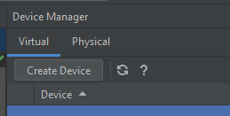
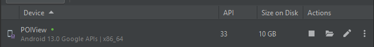

# POI view

The app is written in Android studio so just open the project.

## Configure tokens

To get POIView app running configure Mapbox secret token first with following steps

- open (or create) `~/.gradle/gradle.properties` file
- define `MAPBOX_DOWNLOADS_TOKEN` variable with access token this way

```
MAPBOX_DOWNLOADS_TOKEN=YOUR_SECRET_MAPBOX_ACCESS_TOKEN
```

> for access token (`YOUR_SECRET_MAPBOX_ACCESS_TOKEN`), create Mapbox account, then go to *Tokens* section and create token with `Downloads:Read` checked in a *Secret* section.

Then configure your public Mapbox token with following steps

> **note**: this is already done

- create dedicated public token for sample in Mapbox account
- define `mapbox_access_token` in `res/values/strings.xml` file this way

```xml
<string name="mapbox_access_token">pk.eyJ1IjoiYWRhbS1obGF2YXRvdmljIiwiYSI6ImNsY291Z3IwMzAyM2MzcHF5dmZ3b3J3OW8ifQ.Dn3oDvBJKVHgOKYyqaZyVA</string>
```

## Create VD

To run POIView on a develop machine we need to create virtual device first so

- in Android Studio click to *Create Device* button in *Device Manager* window

	

- select Pixel 6
- click to *Next* button
- as a system image select *Tiramisu* API Level=33 for with x86_64 ABI (Android 13)
- click *Next* button to continue
- use `POIView` as *AVD Name* and
- under *Advanced Settings* increase *Internal Storage* to `4G`
- and *SD card* size to `2GB`
- click to *Finish* button

You should now see your new divice in a *Device Manager* window this way


